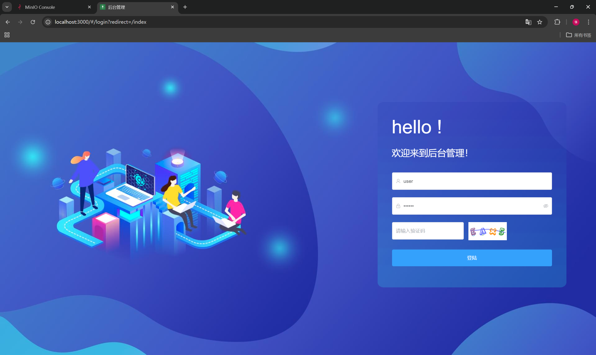
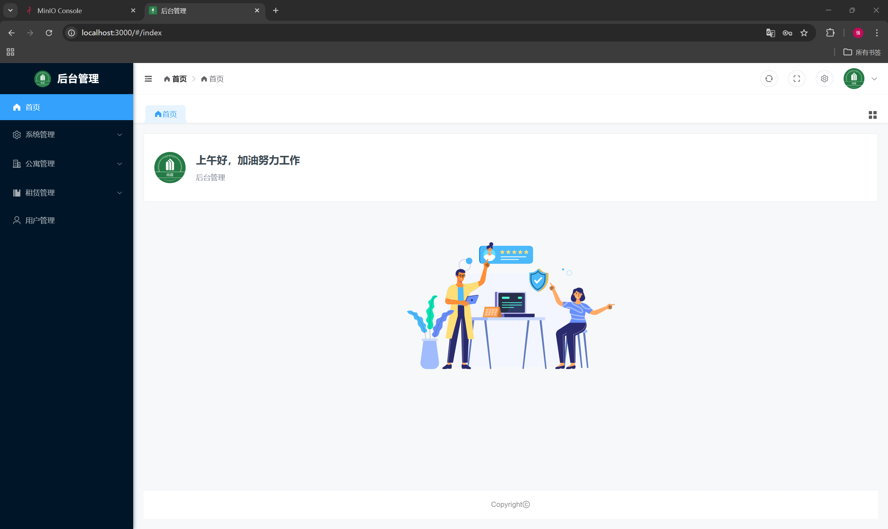
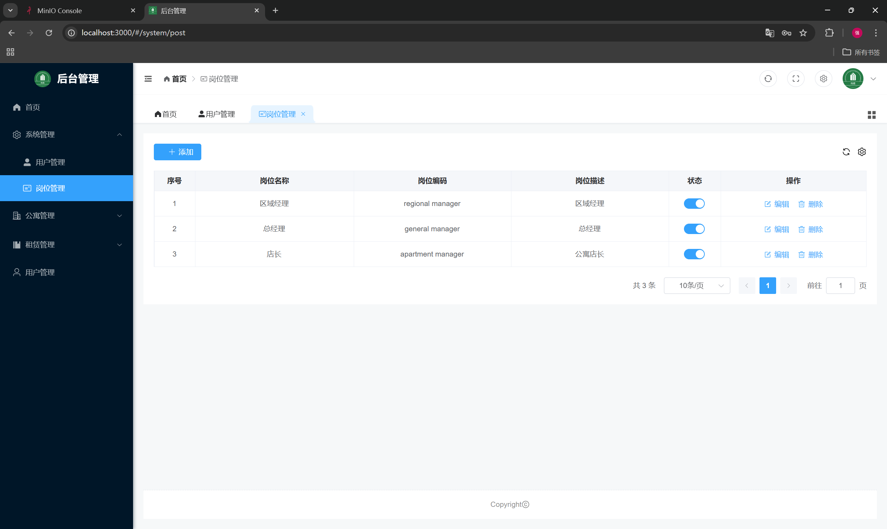
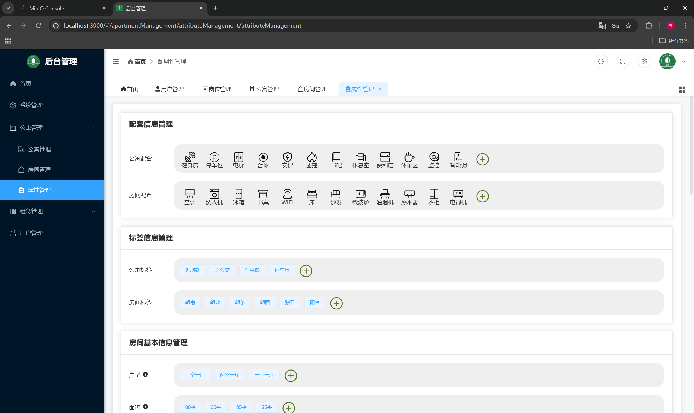
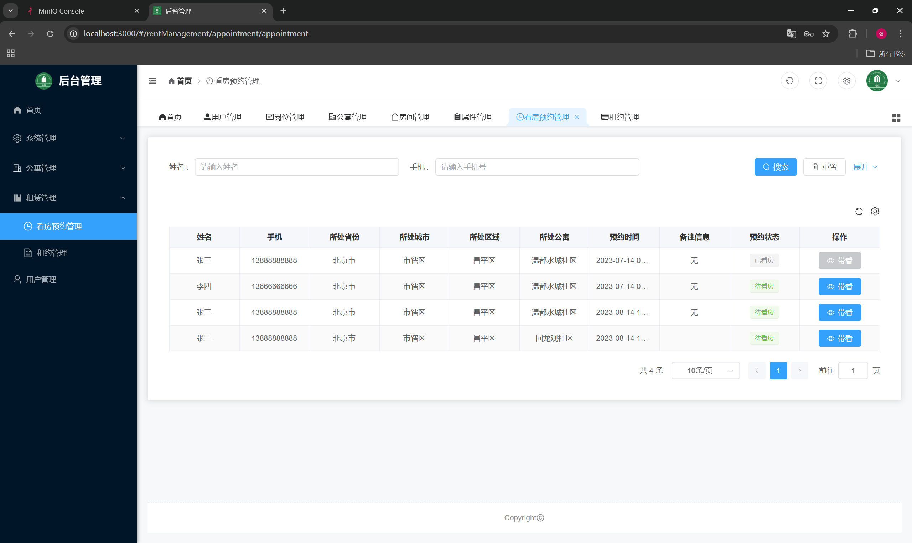
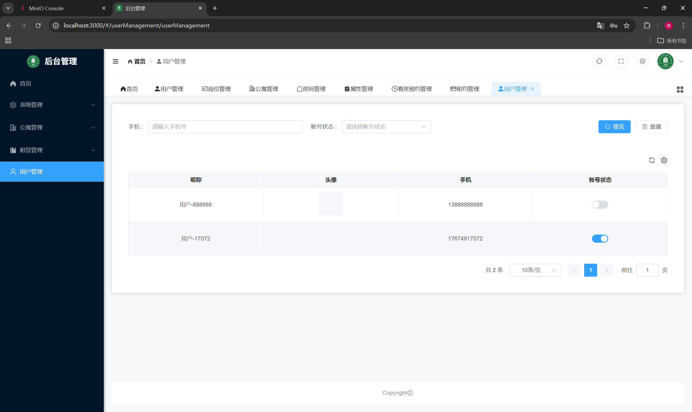

# 项目背景
这是一个公寓租赁平台项目，包含**后台管理系统**，后台管理系统面向管理员，提供公寓（房源）管理、租赁管理、用户管理等功能。

### 功能模块

各功能模块具体内容如下

- **公寓信息管理**

  这个模块负责管理所有公寓的基本信息，包括公寓名称、地址、联系方式等。管理员可以在这里添加、编辑、删除公寓信息。

- **房间信息管理**

  该模块负责管理每个公寓内各个房间的详细信息，包括房间号、户型、面积、租金等。管理员可以在这里进行房间信息的添加、编辑和删除。

- **公寓/房间属性管理**

  这个模块允许管理员定义公寓和房间的各种属性，比如公寓和房间的配套设施，方便管理员在维护公寓信息和房间信息时进行选择。

- **看房预约管理**

  该模块用于管理用户的看房预约请求。用户可以在移动端提交看房预约，管理员可以在后台管理系统中查看和处理这些请求，以方便安排人员接待用户。

- **租约管理**

  这个模块用于管理租约的创建、修改和终止。管理员可以在这里生成租约合同，并发送给用户签约。

- **后台系统用户管理**

  该模块用于管理后台系统的用户账户信息，管理员可以创建、编辑、删除、禁用账户信息。

- **移动端用户管理**

  这个模块负责管理移动端用户的信息。管理员可以查看用户信息，处理账户相关问题。

### 功能展示

#### 登录页面





#### 系统管理（部分）



#### 公寓管理（部分）



租赁管理（部分）



#### 用户管理



# 源码结构
```
lease
├── common（公共模块——工具类、公用配置等）
│   ├── pom.xml
│   └── src
├── model（数据模型——与数据库相对应地实体类）
│   ├── pom.xml
│   └── src
├── web（Web模块）
│   ├── pom.xml
│   ├── web-admin（后台管理系统Web模块——包含mapper、service、controller）
│       ├── pom.xml
│       └── src
└── pom.xml
```

# 开发相关

该项目主要涉及到的基础设施为mysql、reids、minio。该项目在私有虚拟机测试，能够稳定运行。

- 虚拟机配置：
  - 系统 - CentOS 7.6 64bit
  - CPU - 2核 
  - 内存 - 2GB
  - 系统盘 - 50GB
  - 带宽 - 4Mbps

# 启动指南

## 环境准备

在启动项目之前，请确保您的开发环境满足以下要求：

- **Java SDK**: JDK 17+
- **Maven**: 3.6+
- **Node.js**: LTS 版本 (建议 16+ 或 18+)
- **数据库**: MySQL 8.0+
- **缓存**: Redis
- **对象存储**: MinIO

## 后端启动 (lease_system)

1. **配置数据库与中间件**
   打开 `lease_system/web/web-admin/src/main/resources/application.yml` 文件，修改以下配置以匹配您的本地环境：
   - MySQL 连接地址、用户名、密码
   - Redis 主机地址、端口
   - MinIO 端点地址、Access Key、Secret Key、Bucket Name

2. **启动应用**
   在 `lease_system` 目录下，您可以通过以下方式启动：
   - **IDE 启动**: 找到 `web/web-admin` 模块下的 `com.atguigu.lease.AdminWebApplication` 类，运行 `main` 方法。
   - **Maven 启动**: 进入 `web/web-admin` 目录，执行 `mvn spring-boot:run`。

   启动成功后，后端服务默认运行在端口 `18080`。

## 前端启动 (vue)

1. **进入前端目录**
   ```bash
   cd vue
   ```

2. **安装依赖**
   ```bash
   npm install
   ```

3. **启动开发服务器**
   ```bash
   npm run dev
   ```

   启动成功后，控制台会输出访问地址（通常为 `http://localhost:5173`）。

4. **构建生产环境代码 (可选)**
   ```bash
   npm run build
   ```

